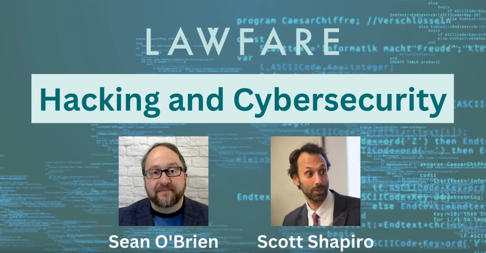

# Hacking &amp; Cybersecurity class materials

**Instructors:** [Scott J. Shapiro](https://law.yale.edu/scott-j-shapiro) &amp; [Sean O'Brien](https://cyberclear.cc)
<!-- **Guest Instructor:** [Laurin Weissinger](https://laurinw.com), Week 8: Networking III -->

## Welcome Future Hackers!

We're updating the materials for our [Hacking &amp; Cybersecurity course](https://www.lawfareblog.com/lawfare-hacking-and-cybersecurity-course) here. [Check out the first video!](https://www.youtube.com/watch?v=MLNlf8iNB4Y)

For the previous course materials, see [this repository](https://github.com/lawfareblog/hacking-cybersecurity).

## What Is This Course?

To understand what this course is all about, read the press coverage and intro articles.

* [A Lawfare Hacking and Cybersecurity Course](https://www.lawfareblog.com/lawfare-hacking-and-cybersecurity-course)
* [Can You Hack It? Find Out In Our Lawfare Class](https://www.lawfareblog.com/can-you-hack-it-find-out-our-lawfare-class)
* [If Students Can Hack This Course, They’re Ready for Information Age Lawyering](https://law.yale.edu/yls-today/news/if-students-can-hack-course-theyre-ready-information-age-lawyering)
* [Knowing How to Hack Will Be Vital In a Cybercrime-filled Future](https://www.newscientist.com/article/mg25834390-100-the-cyber-lawyer-who-wants-to-teach-everyone-how-to-hack/)
* [This Is Why I Teach My Students How to Hack](https://www.nytimes.com/2023/05/23/opinion/cybersecurity-hacking.html)

